Visualization
=============

After the pre-processing step, we have the following Visualizations to better undestand the data.

Dashboard Plots
---------------

In order to find the overall distribution of the video game sales, we have the following plots. We have options to choose different regions and different topics such as Publisher, Genre ,and Platform. For example, for Global sales and Publisher we have,

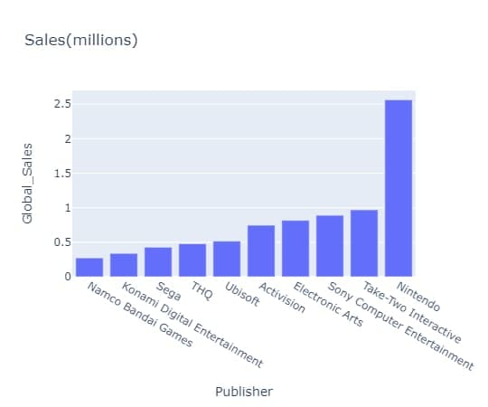

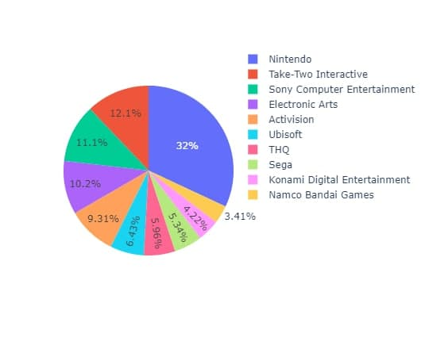

For sales vs years with different regions and genres,

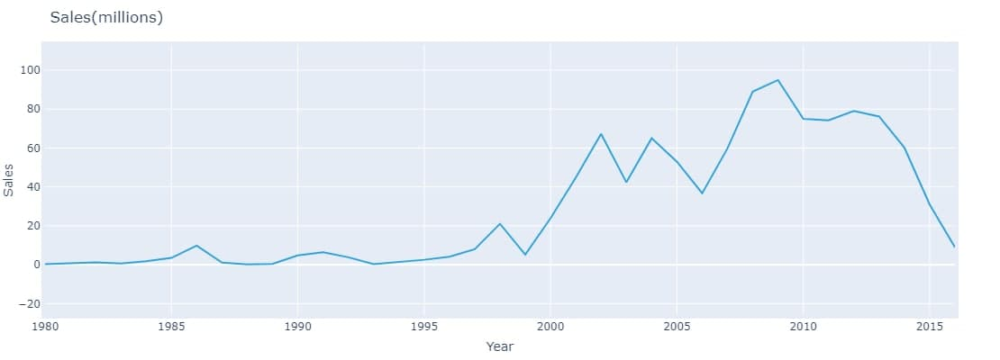

we can change the regions and also topics including action, shooter and etc.

And finally we have sales barplots with different genres by choosing different regions. For example, for Global sales we have,

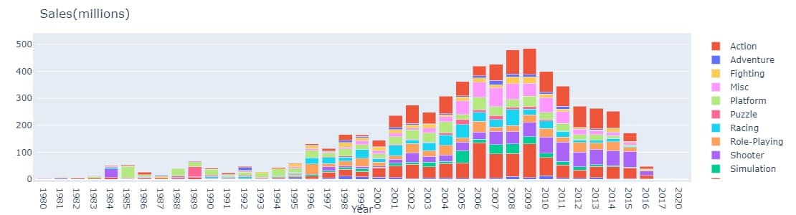

Other Plots
-----------
Here are more plots to underastand the data better.

The correlation between the features,

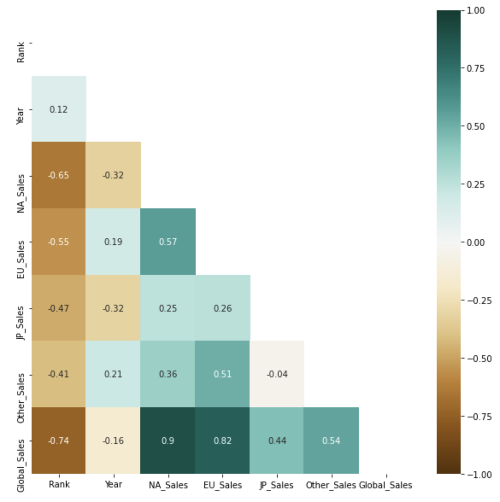

Our target Value is Golbal sales. The Global sales in different years is,

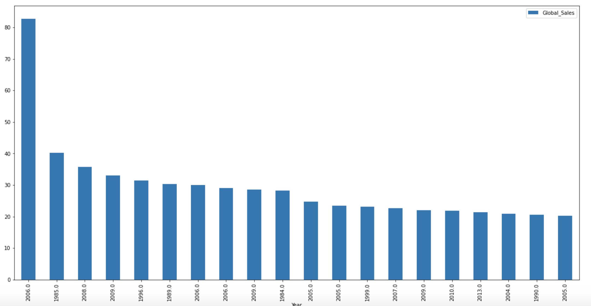

and the Genres in Global sales are,

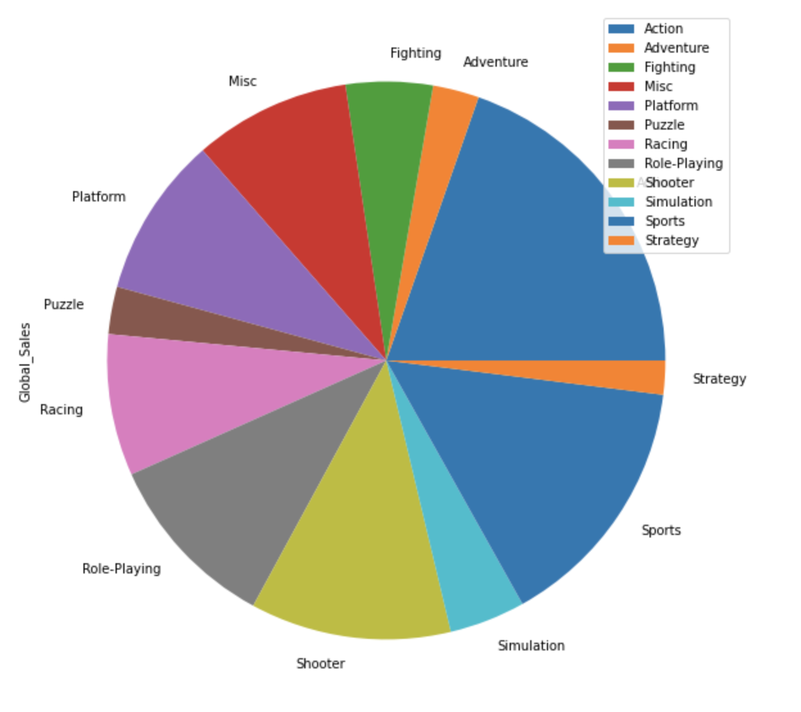

Now Lets Analyze Platform , Genre, and Publisher in all the region sales.

for Global Sales,

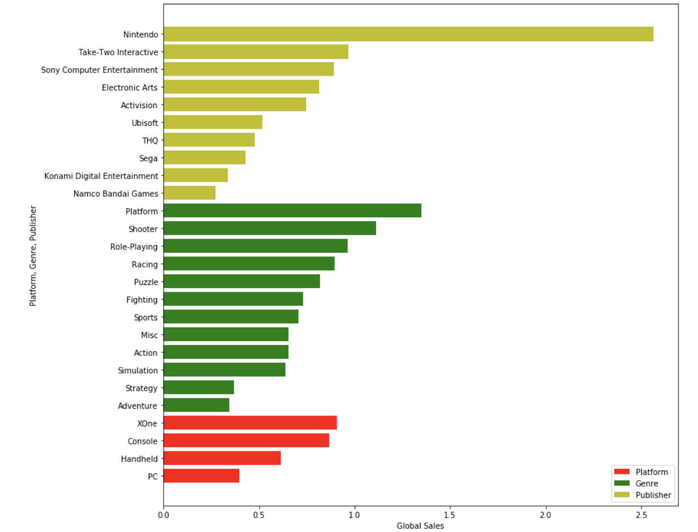

For Europe Sales,

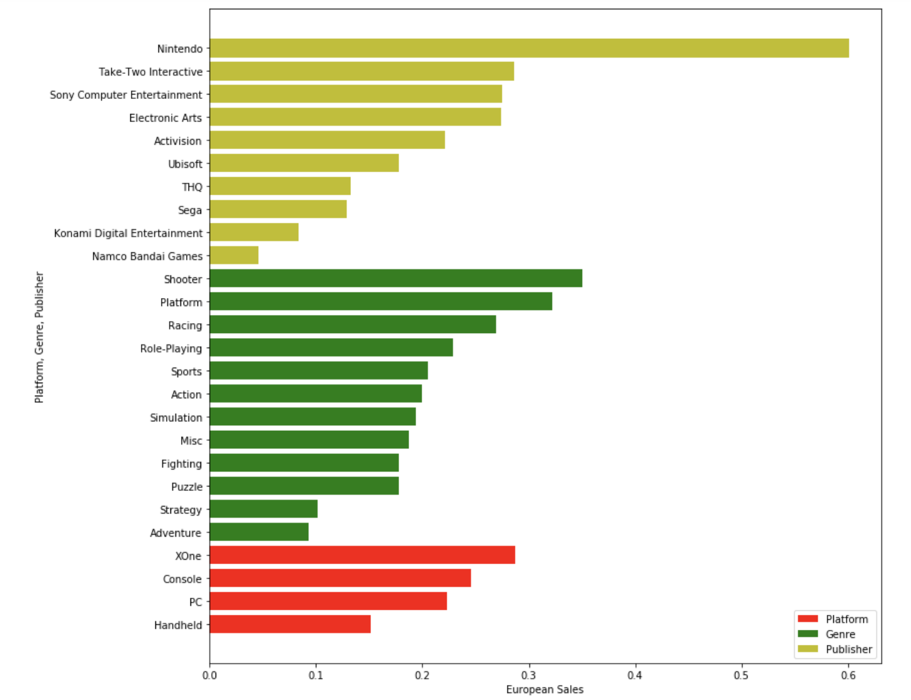

for North America sales,

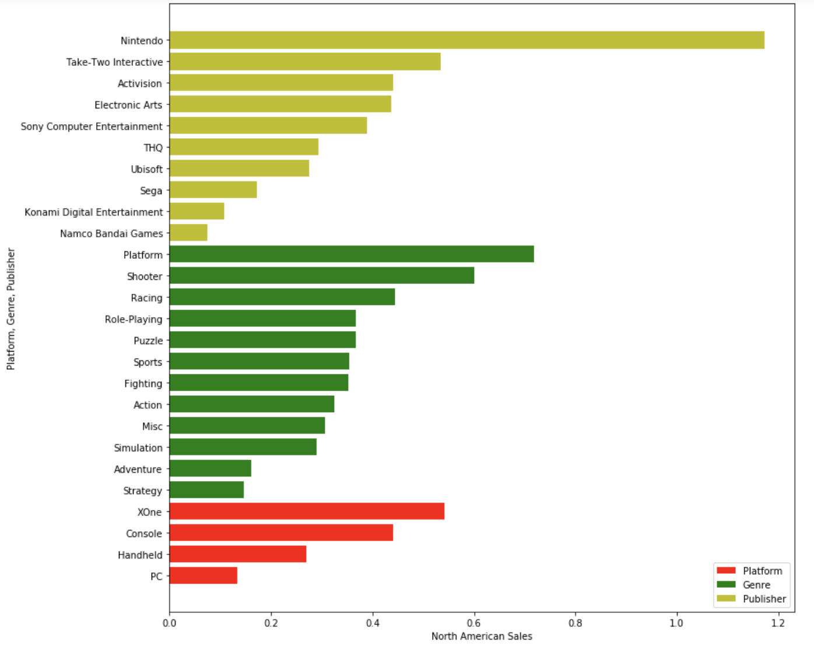

for Japan sales,

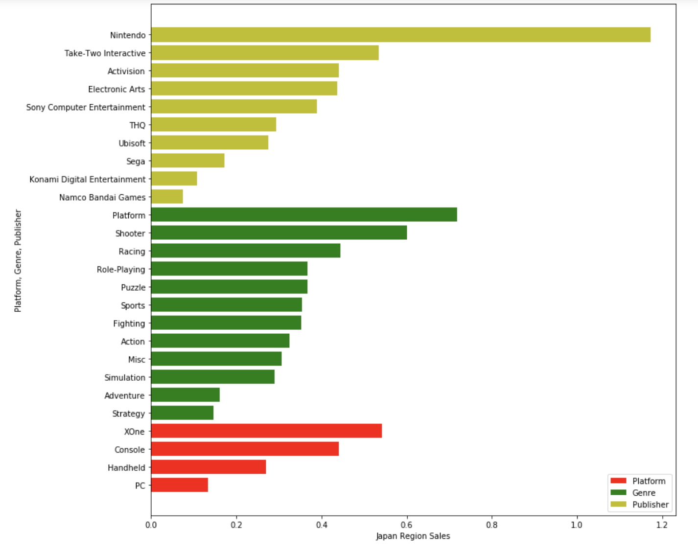
